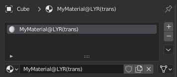
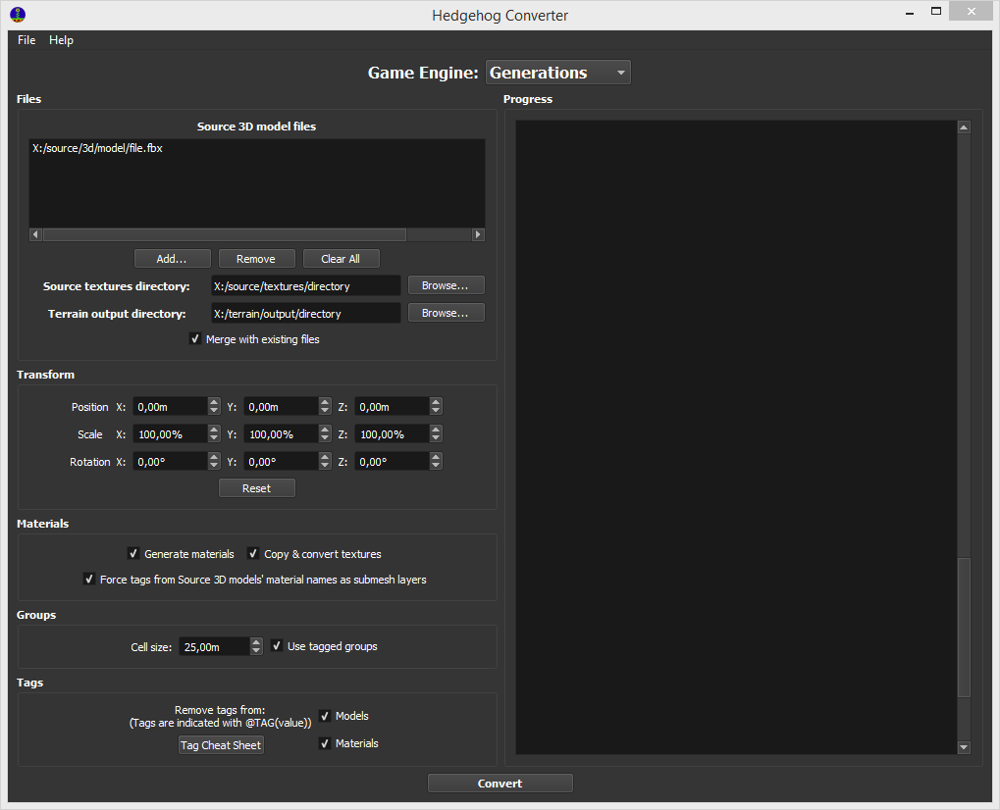

!!! info
    This guide uses the following tools:

    - [Sonic GLvl](/tools/hedgehog-engine/blueblur/levels/#sonicglvl){ target="_blank"}
	- [Blender](/tools/hedgehog-engine/blueblur/levels/#blender){ target="_blank"}
	- [HedgeArcPack](/tools/hedgehog-engine/common/files/#hedgearcpack){ target="_blank"}

# How To Import Custom Terrain in Sonic Generations

#### Part 1 (Creating Terrain in Blender)
First of all, you need terrain for your level. You can do the terrain yourself, or take already created terrain.
If your level contains transparent materials you need to add a proper layer tag to it. For transparency, you have two available layers, and you should pick the one that's best suited for your use case in order to avoid issues.

Layers | Usage
------ |-------
trans  | Used for translucent materials, as in, materials which are not 100% opaque but also not 100% transparent (ex. windows)
punch  | Used for materials which have binary transparency (one part is 100% opaque, another is 100% transparent). Useful for most kinds of textures, like leaves or grass

In order to specify a layer for a material, use the `@LYR` prefix, with the layer name between parenthesis after it.
!!! info "Example"
    

You can export your terrain in the FBX format. 

#### Part 2 (Importing the Level to the Game)
Download SonicGlvl, and run <code style="color: green;">bin/HedgehogConverter.exe</code>. Fill up the following entries:

- Source 3D model files - Your terrain model files
- Source textures directory - Directory containing the texture files of your terrain
- Terrain output directory - Directory which will contain the converted terrain

Be sure to also turn on the following options under "Materials":

- Generate materials
- Copy and convert materials"
- Force tags from Source 3D models' material names as submesh layer

In the end, you should have a similar setup to this:

Next, click <code style="color: red;">"Convert"</code> button and just wait. 

After converting, go to your level's directory and extract any .ar archive using HedgeArcPack. After that, extract archives from original level in bb or bb2.cpk/Packed/ folder. I'll be using ghz200 stage.
Take <code style="color: green;">ghz200_Direct01.light</code> and drop this file in your level's archive and pack it.
Next, you'll need to unpack the # file which is localed in the root of cpk. In my case, it is <code style="color: green;">#ghz200.ar.00</code>. Unpack it, and open <code style="color: green;">"Terrain.stg.xml"</code>, find DataName, paste your light file's name without the extension and save it.

Pack this archive and drop it in your mod's folder. Now you should have your mod files with a setup that looks something like this:

???+info "Root folder"
    

???+info ""disk" folder"
    

???+info ""Packed/LevelSlot" folder"
    

#### Part 3 (Sonic GLvl Basic Setup)

Next up, open your level in SonicGlvl by opening the # file, and press Ctrl+A, Delete. It'll delete all the objects from your level. Find <code style="color: green;">"SonicSpawn"</code> in the objects menu and place it anywhere. 
Be sure to set "Active" to "true" in the settings of <code style="color: green;">"SonicSpawn"</code> object. 

After that, press "File", "Save Stage Data" and "Save Stage Terrain".

#### Part 4 (Creating Skybox)

Skyboxes in Sonic Generations is just regular model files. You can take them from the original levels or create them yourself. 
Take your skybox's files and drop them into your level archive. Then, open # file, and open <code style="color: green;">Terrain.stg.xml</code> again. Find Model and paste your skybox's model name here without the extension and save it.

 

But this is only the terrain and skybox, now you need to create collision for your level. You can see this tutorial [here](/guides/hedgehog-engine/blueblur/levels/importing-collision).