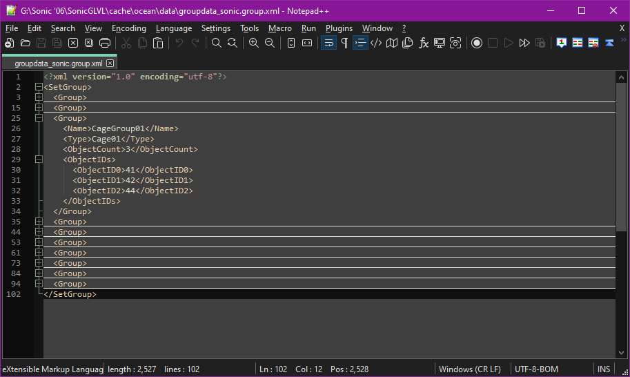
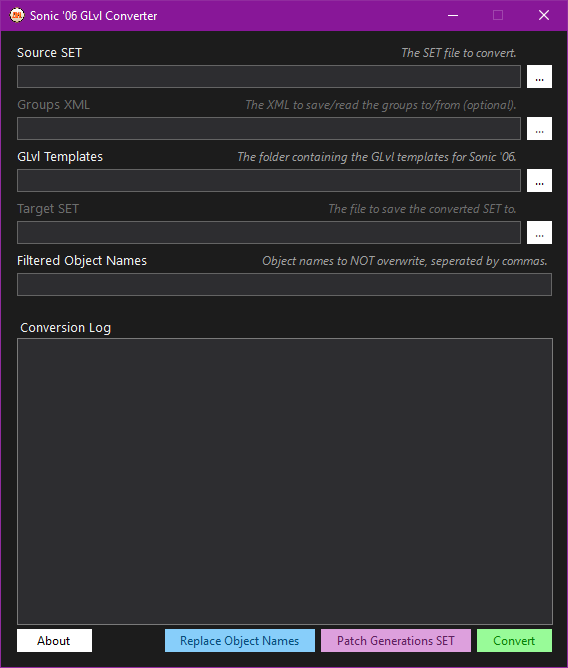

!!! info
    This guide uses the following tools:

    - [Sonic GLvl](https://github.com/DarioSamo/libgens-sonicglvl){ target="_blank"}
    - [Sonic '06 Stage Editing Archive](https://github.com/Knuxfan24/Sonic-06-Stage-Editing-Archive){ target="_blank" }

!!! note
    Due to a lack of an actual, dedicated level editor for Sonic '06, we (at the time of writing) use a hacked together solution that allows us to use Sonic GLvl as a stand in. This guide will explain how to set up GLvl for this purpose, with the assumption that the user understands basic usage of the program itself.

# How to use Sonic GLvl with Sonic '06

## Setting Up
Download your preferred version of Sonic GLvl 0.9 and extract the repository to any location. Then, open the database folder and delete the `objects` folder. Next, download the [Sonic '06 Stage Editing Archive](https://github.com/Knuxfan24/Sonic-06-Stage-Editing-Archive) and extract the `SonicGLvl/database` folder to your SonicGLvl location, choosing to merge/replace existing files.

## Converting Stage Terrain
Pre converted copies of the actual Sonic '06 stages are present on the Stage Editing Archive repository (under the `SonicGLvl/import` directory). When converting your own terrain (such as for a stage mod) the process is almost identical to the conversion process for Sonic Generations (it's recommended to use the two `#base` files as a template). The crucial step is to remember to set the stage scale in HedgehogConverter to 1% on all three axis, as the scale does not match between both games.

## Usage
The process of placing and editing objects at this point follows the workflow of using Sonic GLvl for a Generations stage mod, so will not be covered here.

## Groups
Objects in '06 make frequent usage of grouping, allowing objects to influence each other in some way (such as an Egg Chaser commanding a squad of Egg Liners or defeating an enemy unlocking a cage). To set these up, create an XML in your stage's cache directory called `groupdata_[x].group.xml` (where [x] is a name, such as `base`). Then lay them out as shown below.

Each <Group\> key is... Well... A Group that will be compiled into the converted SET.

The <Name\> key seems to just be for identification, so here (for Ocean Palace) I called it `CageGroup01` as it was the first group I made that unlocked a cage.

The <Type\> key is the name of the lua event that this group will activate, this key can be left empty if the group doesn't need to activate anything. In this example, it's called Cage01, so it will fire the event called Cage01 in the stage's lua file; which, as you can probably guess, signalled a cage to open.

The <ObjectCount\> key simply lists how many objects this group has (and honestly shouldn't have even been a thing, but I wrote this thing incredibly badly).

The subkeys within the <ObjectIDs\> key simply give the ID of an object that should be in this group. These IDs are shown in the conversion log, and are also patched into the Generations SET if the `Patch Generations SET` option is used in the Converter (see below).

## '06 SET Conversion

For converting between Generations and '06, we use the GLvl Converter. In the Source SET, select your Generations `.set.xml` file from your stage's cache directory in your GLvl location (will be named `setdata_base.set.xml` by default). If you've created any groups for your object layout (which need to be made manually, see above), then select the approriate `groupdata_[x].group.xml` file for the Groups XML option, otherwise, leave it blank.

For the GLvl Templates, select the `database\objects` folder.

Target SET is simply where you want to save the converted object placement to.

Filtered Object Names will prevent the `Replace Object Names` option from overwriting objects that have any of the inputted values as part of their names. This object is useful for group events where you're activating an object by its name.

This converter can also convert from '06 to Generations by simply putting an '06 `.set` file as the source and a Generations `.set.xml` as the target. This can also convert '06 groups into an XML if a Groups XML path is specified.

Due to how Sonic GLvl handles object IDs, they will often not match with the IDs that '06 uses. To correct this, choose the `Patch Generations SET` option, which will update the Generations `.set.xml` to show the correct IDs.